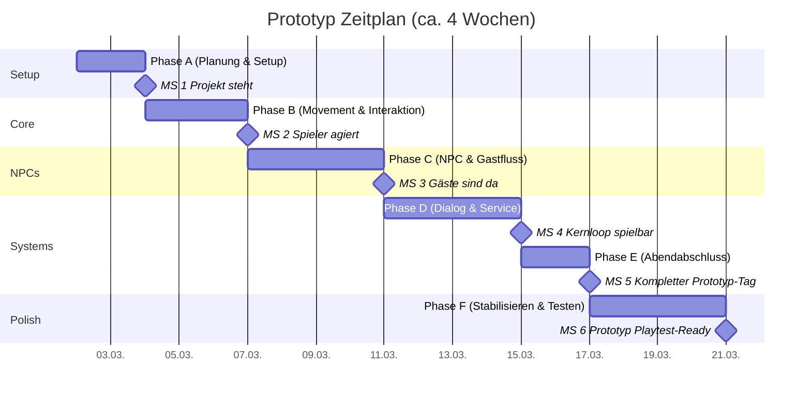

# Prototyp-Plan – Inn/Tavernen-Spiel (PS1-inspirierter 3D-Look, Story später)

## Ziel dieses Dokuments

Dieses Dokument beschreibt den **Arbeitsplan** und **Programmierplan** für einen **spielbaren Prototypen** deines Inn-/Tavernen-Spiels.

**Wichtig:**  
- **Keine Story-Implementierung**
- **Kein finaler Artstyle**
- **Keine vollständigen Features**
- Fokus auf **Core Loop testen**: Gäste empfangen -> bedienen -> Dialog-Entscheidung -> Abend beenden

---

## Projektziel (Prototyp)

Wir bauen einen **kleinen Vertical Prototype**, der nur beweist, dass die Grundidee funktioniert:

- Spieler kann sich in einer einfachen Taverne bewegen
- Gäste erscheinen
- Spieler kann Gäste ansprechen
- einfacher Service (z. B. `Ale`, `Water`, `Stew`)
- einfacher Dialog mit Auswahloptionen
- einfache Zustandsänderungen (Ruf/Vertrauen/Flag)
- Abend endet und kann neu gestartet werden

### Nicht-Ziel (für später)
- Story-Arcs
- komplexes Kochen
- umfangreiche KI
- finale Grafik/Animation
- viele Räume
- Save/Load (optional, erst später)
- Combat/Open World

---

## Annahmen (für diesen Plan)

**Engine-Empfehlung:** Godot 4.x (3D)  
Warum für den Prototyp:
- schnell iterierbar
- gute Szene-Struktur
- UI + Dialog relativ schnell umsetzbar
- ausreichend für Low-Poly/PS1-inspirierten Look

> Falls du lieber Unity nutzt, bleibt die Struktur ähnlich – nur die technische Umsetzung ändert sich.

---

# 1) Prototyp-Definition (MVP)

## Prototyp-Loop (erste Version)

1. Spieler startet im Schankraum
2. 1–3 Gäste erscheinen nacheinander
3. Spieler interagiert mit Gast
4. Gast äußert Wunsch (Drink/Food/Talk)
5. Spieler wählt eine Antwort / serviert etwas
6. Gast reagiert (einfacher Zustandswechsel)
7. Nach allen Gästen: Tagesabschluss-Screen
8. Neustart / nächster Testabend

## Erfolgskriterium (Definition of Done für Prototyp v0.1)
Der Prototyp ist erfolgreich, wenn:
- die komplette Schleife **ohne Crash** spielbar ist
- mindestens **3 Gäste** in einem Abend abgearbeitet werden können
- mindestens **1 Entscheidung** sichtbare Folge hat (anderer Dialog / anderer Score)
- du nach 2–3 Testrunden sagen kannst: „Das macht grundsätzlich Spaß / hat Potenzial“

---

# 2) Arbeitsplan (Projektorganisation)

## Phase A – Planung & Setup (1–2 Tage)
Ziel: Arbeitsumgebung, Scope, Struktur festlegen

### Aufgaben
- [x] Projektordner anlegen
- [x] Godot-Projekt erstellen
- [x] Git-Repository anlegen
- [x] `.gitignore` einrichten
- [x] Prototyp-Ziel schriftlich festhalten (dieses Dokument)
- [ ] Ticket-/Taskliste erstellen (Trello/Notion/Markdown reicht)

### Ergebnis
- Laufendes leeres Projekt
- Klare To-do-Liste
- Scope ist definiert

---

## Phase B – Movement & Interaktion (2–4 Tage)
Ziel: Spieler kann im Raum laufen und Dinge ansprechen

### Aufgaben
- [ ] Testraum (einfacher Blockout) bauen
- [ ] Player-Controller (laufen, drehen, Kamera)
- [ ] Interaktionssystem (Raycast/Area + Taste)
- [ ] Interaktions-Prompt (`E: Interagieren`)
- [ ] Platzhalterobjekte (Tisch, Tresen, Tür)

### Ergebnis
- 30 Sekunden spielbarer Build
- Spieler kann sich frei bewegen und Interaktion auslösen

---

## Phase C – NPC & Gastfluss (2–4 Tage)
Ziel: Gäste erscheinen und können angesprochen werden

### Aufgaben
- [ ] NPC-Basisklasse erstellen
- [ ] Gast-Datenstruktur definieren (Name, Bestellung, Dialog-ID, Mood)
- [ ] Spawn-Manager (ein Gast nach dem anderen)
- [ ] Sitzplatz-/Zielpunkt-System (vereinfacht)
- [ ] Zustände: `Entering`, `Waiting`, `Talking`, `Served`, `Leaving`

### Ergebnis
- Gäste tauchen auf, warten, können interagiert werden, gehen wieder

---

## Phase D – Dialog & Service-Prototyp (3–5 Tage)
Ziel: Kernloop spielbar machen

### Aufgaben
- [ ] Dialog-UI (Text + Antwortoptionen)
- [ ] Dialogdaten (JSON oder Godot Resource)
- [ ] Einfaches Service-Menü (`Ale`, `Water`, `Stew`, `Room`, `Nothing`)
- [ ] Gastreaktionen je nach Auswahl
- [ ] Basiswerte: `Trust`, `Patience`, `Mood`
- [ ] Flags/Entscheidungen (z. B. `helped_merchant = true`)

### Ergebnis
- Erste echte Schleife wie gewünscht: reden + bedienen + Reaktion

---

## Phase E – Abendabschluss & Feedback (1–3 Tage)
Ziel: Runde abschließen und messbar machen

### Aufgaben
- [ ] End-of-night Screen
- [ ] Score/Debug-Zusammenfassung:
  - Gäste bedient
  - richtige/falsche Services
  - Trust-Änderungen
  - gesetzte Flags
- [ ] Reset-Funktion / nächster Prototyp-Abend
- [ ] Basic Balancing (Wartezeit, Anzahl Gäste)

### Ergebnis
- Testbare Runde mit Abschluss

---

## Phase F – Stabilisieren & Testen (2–4 Tage)
Ziel: Prototyp robust genug zum Bewerten machen

### Aufgaben
- [ ] Bugs fixen
- [ ] Null-/Edge-Cases prüfen (kein Gast, falsche Auswahl, doppelte Interaktion)
- [ ] UI-Lesbarkeit verbessern
- [ ] kurze interne Testsession (3–5 Durchläufe)
- [ ] Erkenntnisse dokumentieren: Was macht Spaß? Was fehlt?

### Ergebnis
- Bewertbarer Prototyp
- Entscheidungsgrundlage für nächste Iteration

---

# 3) Programmierplan (technische Umsetzung)

## Architekturprinzipien für den Prototyp

### Ziel
Schnell bauen, leicht ändern, kein Overengineering.

### Prinzipien
- **Datengetrieben**, wo es schnell hilft (Dialoge/Gäste)
- **Klare kleine Systeme**
- **Lose Kopplung**
- **Debugbarkeit vor Perfektion**

---

## Empfohlene Projektstruktur (Godot)

```text
res://
  scenes/
    main/
      Main.tscn
      TavernPrototype.tscn
    player/
      Player.tscn
    npc/
      Guest.tscn
    ui/
      HUD.tscn
      DialogUI.tscn
      ServiceMenu.tscn
      EndNightUI.tscn
  scripts/
    core/
      game_manager.gd
      event_bus.gd (optional)
    player/
      player_controller.gd
      interactable.gd
    npc/
      guest.gd
      guest_state_machine.gd (optional, kann später kommen)
      guest_spawner.gd
    systems/
      interaction_system.gd
      dialog_system.gd
      service_system.gd
      night_manager.gd
      score_system.gd
    data/
      dialog_loader.gd
      guest_database.gd
  data/
    dialogs/
      guest_merchant.json
      guest_guard.json
      guest_traveler.json
    nights/
      night_01.json
  ui/
    theme/ (später)
  assets/
    blockout/ (Platzhalter)
```

---

## Kernsysteme (erste Version)

## 3.1 GameManager
Verantwortlich für:
- Spielstatus (Menü / Night / Dialog / EndNight)
- Systeminitialisierung
- Übergänge zwischen Phasen

### Beispiel-Zustände
- `BOOT`
- `IN_NIGHT`
- `IN_DIALOG`
- `IN_SERVICE_MENU`
- `END_NIGHT`

---

## 3.2 PlayerController
Verantwortlich für:
- Bewegung
- Kamera (einfach)
- Interaktion auslösen

### Anforderungen v0.1
- WASD / Stick Bewegung
- Maus oder rechter Stick Kamera (oder fixe Kamera für schnelleren Start)
- Interaktionstaste (`E`)
- Bewegung sperren während Dialog

---

## 3.3 InteractionSystem
Verantwortlich für:
- Was ist gerade ansprechbar?
- Prompt anzeigen
- Interaktion an Ziel weitergeben

### Für den Prototyp ausreichend
- Raycast von Kamera
- `Interactable`-Interface/Script mit `interact(player)`

---

## 3.4 Guest/NPC-System
Verantwortlich für:
- Gastdaten halten
- Gastzustand verwalten
- Reaktion auf Dialog/Service

### Minimaler Gastdatensatz (v0.1)
- `id`
- `display_name`
- `requested_item`
- `patience`
- `mood`
- `dialog_root_id`
- `tags` (optional, z. B. `merchant`, `guard`)
- `flags_on_success`
- `flags_on_fail`

### Gastzustände (einfach)
- `ENTERING`
- `SEATED`
- `WAITING_FOR_SERVICE`
- `TALKING`
- `SERVED`
- `LEAVING`

---

## 3.5 DialogSystem
Verantwortlich für:
- Dialog anzeigen
- Antwortoptionen
- Verzweigungen
- Flags setzen
- Trigger an andere Systeme senden

### Datenformat (Beispiel JSON)
```json
{
  "id": "merchant_intro",
  "nodes": {
    "start": {
      "speaker": "Merchant",
      "text": "Long road. Got anything warm?",
      "choices": [
        {"text": "Ale", "action": "open_service"},
        {"text": "Ask what happened", "next": "rumor"},
        {"text": "Leave", "next": "end"}
      ]
    },
    "rumor": {
      "speaker": "Merchant",
      "text": "Road's bad. Too many patrols tonight.",
      "effects": [{"flag": "heard_patrol_rumor", "value": true}],
      "choices": [
        {"text": "Serve ale", "action": "open_service"},
        {"text": "End talk", "next": "end"}
      ]
    }
  }
}
```

> Für den Start kannst du Dialoge auch direkt in GDScript als Dictionaries speichern. JSON lohnt sich, sobald mehrere Gäste da sind.

---

## 3.6 ServiceSystem
Verantwortlich für:
- Service-Menü öffnen
- Auswahl prüfen
- Reaktion bestimmen
- Ergebnis an Gast + Score melden

### Startversion (bewusst simpel)
**Items:**
- `Ale`
- `Water`
- `Stew`
- `Nothing`

**Regeln:**
- Wenn Auswahl == Wunsch -> positiver Effekt
- Sonst neutral/negativ
- Optional: manche Gäste mögen bestimmte Antworten trotz falscher Bestellung

### Rückgabewert (Beispiel)
```gdscript
{
  "success": true,
  "trust_delta": 1,
  "mood_delta": 1,
  "patience_delta": 0,
  "flags": ["served_merchant_correctly"]
}
```

---

## 3.7 NightManager
Verantwortlich für:
- Reihenfolge der Gäste in einer Nacht
- Spawn-Timing (einfach)
- Abschlussbedingung (alle Gäste fertig)

### Night-Daten (v0.1)
```json
{
  "night_id": "night_01",
  "guest_sequence": [
    "merchant_01",
    "guard_01",
    "traveler_01"
  ]
}
```

---

## 3.8 Score/Debug-System
Verantwortlich für:
- Prototyp-Messwerte sammeln (wichtig für Game Design!)
- Endscreen befüllen

### Empfohlene Metriken
- Anzahl Gäste insgesamt
- korrekt bediente Gäste
- falsch bediente Gäste
- Dialogentscheidungen (welche gewählt wurden)
- gesetzte Flags
- Durchschnittswartezeit (optional)
- Abbruchfälle/Bugs (manuell notieren)

---

# 4) Programmier-Reihenfolge (sehr konkret)

## Sprint 1 – „Es bewegt sich“
**Ziel:** Spieler + Raum + Interaktion

1. Projekt erstellen
2. Testszene bauen
3. Player-Controller
4. Kamera
5. Interaktions-Prompt
6. Dummy-Objekt mit Interaktion

### Done, wenn:
- du im Raum laufen kannst
- `E` ein Popup / Print auslöst

---

## Sprint 2 – „Ein Gast existiert“
**Ziel:** Ein NPC ist ansprechbar

1. `Guest.tscn` erstellen
2. Gast-Placeholder im Raum platzieren
3. `guest.gd` mit Basisdaten
4. Interaktion -> Gastdialog startet
5. Dialogfenster zeigt Text

### Done, wenn:
- Gast anklickbar/ansprechbar ist
- Dialog sichtbar ist

---

## Sprint 3 – „Dialog + Auswahl“
**Ziel:** Entscheidung im Gespräch

1. Dialogdaten strukturieren
2. DialogSystem lädt Knoten
3. Antwortoptionen rendern
4. Auswahl wechselt Node
5. Ein Flag wird gesetzt

### Done, wenn:
- eine Auswahl eine sichtbare Folge hat

---

## Sprint 4 – „Service-Loop“
**Ziel:** VA-11-artiger Kernmoment in simpel

1. `ServiceMenu` bauen
2. Gast hat `requested_item`
3. Auswahl prüfen
4. Reaktionstext anzeigen
5. Gaststatus -> `SERVED` / `LEAVING`

### Done, wenn:
- Gast korrekt/falsch bedient werden kann
- Gast reagiert unterschiedlich

---

## Sprint 5 – „Ein Abend“
**Ziel:** Mehrere Gäste und Abschluss

1. `NightManager`
2. Gast-Sequenz spawnen
3. Nächster Gast, wenn vorheriger fertig
4. EndNightUI
5. Zusammenfassung anzeigen

### Done, wenn:
- 3 Gäste nacheinander spielbar sind
- Abend endet mit Übersicht

---

## Sprint 6 – „Stabilisieren“
**Ziel:** Testbarer Prototyp

1. Edge Cases fixen
2. UI aufräumen
3. Debug-Ausgaben verbessern
4. kurze Playtest-Runde
5. Notizen für Iteration 2

### Done, wenn:
- du 3 komplette Durchläufe ohne Blocker spielen kannst

---

# 5) Datenmodell (für frühe Skalierung)

## Globale Prototyp-Daten (`GameState`)
```text
current_night_id
money (optional)
reputation (global, optional)
flags (Dictionary/String->bool)
guest_results (Liste)
```

## Gast-Ergebnis (`GuestResult`)
```text
guest_id
served_item
requested_item
service_success (bool)
trust_delta
mood_delta
flags_set[]
```

## Warum jetzt schon?
Damit du später Story/Feature-Ausbau machen kannst, ohne alles umzubauen.

---

# 6) Technische Risiken & Gegenmaßnahmen

## Risiko 1: Zu viel Zeit in 3D/Art verlieren
**Gegenmaßnahme**
- Nur Blockout-Geometrie
- Primitive Meshes / Platzhalter
- Keine Shader-Experimente vor v0.1

## Risiko 2: Dialogsystem zu komplex bauen
**Gegenmaßnahme**
- Erst lineare Dialoge + 1 Branch
- Keine Conditions, außer 1–2 Flags
- Keine Editor-Tools am Anfang

## Risiko 3: NPC-KI wird zu aufwendig
**Gegenmaßnahme**
- Keine echte KI
- Nur Zustandswechsel + feste Zielpunkte

## Risiko 4: Scope creep durch „coole Ideen“
**Gegenmaßnahme**
- Neue Ideen in `Backlog.md`, nicht sofort umsetzen
- Prototyp-Ziel konsequent schützen

---

# 7) Coding-Standards (leichtgewichtig)

## Regeln
- Kleine Skripte mit klarer Verantwortung
- Funktionen kurz halten
- Magic Numbers vermeiden (Konstanten nutzen)
- Debug-Logs klar benennen (`[Dialog]`, `[Guest]`, `[Night]`)
- Daten/Content von Logik trennen, sobald möglich

## Benennung
- Szenen: `PascalCase.tscn`
- Skripte: `snake_case.gd`
- Konstanten: `UPPER_CASE`
- Signale: `snake_case`

## Strukturierte Debugging-Strategie
Ein klarer Ablauf verhindert Frust, wenn etwas im Prototyp bricht:
1. **Reproduzieren:** Tritt der Fehler immer auf oder nur unter bestimmten Bedingungen (z.B. nur beim zweiten Gast)?
2. **Isolieren:** Bestimme das verantwortliche Kernsystem (Movement, Dialog, Service, NightManager).
3. **Logs auswerten:** Nutze deine Logging-Präfixe (`[Dialog]`, `[Guest]`), um den Flow nachzuvollziehen. Fehlt ein Log, das da sein sollte?
4. **Breakpoints setzen:** Nutze den Godot-Debugger, um Variablen (wie `guest.mood`) zur Laufzeit zu prüfen.
5. **Fix & Smoke Test:** Nach der Fehlerbehebung sofort das Projekt starten und den Smoke Test durchführen, um Regressionen auszuschließen.

---

# 8) Testplan für den Prototyp

## Smoke Tests (nach jedem Sprint / jedem größeren Feature)
Diese Tests dienen dazu, sofort zu prüfen, ob der Build "raucht" (also sofort kaputtgeht). Sollten Automatisierbar oder manuell extrem schnell durchführbar sein.
- **Projektausführung:** Startet das Spiel fehlerfrei ohne Crash (kein schwarzer Bildschirm)?
- **Szenenaufruf:** Lädt die Kernszene (`TavernPrototype.tscn`) sauber?
- **Player-Präsenz:** Spawnt der Player-Character am richtigen Ort und fällt nicht durch den Boden?
- **Keine roten Errors:** Die Godot Console (Debugger) bleibt frei von roten Fehler-Logs bei Start.

## Manuelle Gameplay-Tests (Pflicht für v0.1)
### Test 1: Basisschleife
- Start -> Gast 1 -> bedienen -> Gast 2 -> Gast 3 -> Endscreen

### Test 2: Falsche Auswahl
- absichtlich falsches Item wählen
- prüfen: Reaktion + Score korrekt?

### Test 3: Dialogbranch
- Option A wählen vs. Option B wählen
- prüfen: anderer Text / Flag gesetzt?

### Test 4: Interaktionsspam
- `E` mehrfach drücken
- prüfen: keine Doppel-UI / kein Softlock

### Test 5: Edge Case
- Dialog schließen / Menü schließen in falscher Reihenfolge
- prüfen: Spielzustand bleibt konsistent

---

# 9) Arbeitsroutine (empfohlen)

## Pro Session (60–120 min)
1. **1 klares Ziel**
2. Implementieren
3. 5 Minuten testen
4. Kurze Notiz: Was funktioniert / Was blockiert
5. Nächsten Task festlegen

## Beispiel
- Session 1: Player Movement
- Session 2: Interaktion
- Session 3: Ein Gast + Dialog
- Session 4: Service-Menü
- Session 5: Zweiter Gast + NightManager

---

# 10) Backlog für nach dem Prototyp (nicht jetzt bauen)

Diese Ideen kommen **später**, wenn der Prototyp trägt:

- Story-System / Kapitelstruktur
- PS1-Style Kamera-Inszenierung
- Fixed Camera Pro Raum
- Mood-System im Schankraum
- Zimmervergabe
- Rule Board / Hausregeln
- Schach-Minigame (light)
- Küchen-Minigame erweitert
- Staff-Management
- Save/Load
- Audio / Musik / Atmosphäre
- Fraktionen / Rufsystem erweitert
- Sanctuary/Garden-artiger Rückzugsraum

---

# 11) Nächster konkreter Schritt (heute)

## Startauftrag (empfohlen)
Baue in dieser Reihenfolge die ersten 3 Meilensteine:

### Meilenstein 1
- Godot-Projekt anlegen
- `TavernPrototype.tscn` + Blockout-Raum
- `Player.tscn` mit Bewegung

### Meilenstein 2
- Interaktionssystem mit `E`
- ein Dummy-Gast (`Guest.tscn`)
- Interaktion startet Dialog-Popup

### Meilenstein 3
- Dialog mit 2 Optionen
- `ServiceMenu` mit 3–4 Items
- unterschiedliche Gastreaktion

Wenn diese 3 Meilensteine stehen, ist dein Kernkonzept schon testbar.

---

# 12) Optional: Aufgabenliste für direktes Abarbeiten (kompakt)

## Setup
- [ ] Godot installieren / Projekt anlegen
- [ ] Git init
- [ ] Ordnerstruktur anlegen

## Core
- [ ] Player movement
- [ ] Kamera
- [ ] Interaktion
- [ ] Prompt UI

## NPC
- [ ] Guest scene
- [ ] Gastdaten
- [ ] Spawn eines Gasts
- [ ] Gastzustände (minimal)

## Dialog/Service
- [ ] Dialog UI
- [ ] Dialogdaten
- [ ] Service-Menü
- [ ] Reaktionslogik

## Runde
- [ ] NightManager
- [ ] 3 Gäste-Sequenz
- [ ] Endscreen / Debugscore

## Stabilisierung
- [ ] Bugfixes
- [ ] Testdurchläufe
- [ ] Erkenntnisse notieren

---

# 13) Konkreter Zeitplan & Meilensteine (Timeline)

Basierend auf den geschätzten Dauern der Phasen A bis F (11–22 Entwicklungs-Tage) lässt sich der Prototyp optimal in einem realistischen **3- bis 4-Wochen-Plan** (bei ca. 5 Arbeitstagen pro Woche) umsetzen.

## Ablaufplan (Wochen-Struktur)

**Woche 1: Fundament & Basis-Loop**
- **Tag 1-2:** Phase A (Projekt Setup & Scope) — *Meilenstein 1: Laufendes Projekt*
- **Tag 3-5:** Phase B (Movement, Raum, Interaktion) — *Meilenstein 2: Spieler bewegt sich & interagiert*

**Woche 2: Gäste & Logik**
- **Tag 6-9:** Phase C (NPC Spawner & Gastfluss) — *Meilenstein 3: Gäste erscheinen und warten*
- **Tag 10:** Beginn Phase D (Dialog UI & Datenstruktur)

**Woche 3: Gameplay-Loop & Service**
- **Tag 11-13:** Abschluss Phase D (Service-Menü & Reaktionen) — *Meilenstein 4: Erster voller Dialog- & Service-Loop*
- **Tag 14-15:** Phase E (EndScreen & Score System) — *Meilenstein 5: Kompletter Tavernen-Tag (Night) spielbar*

**Woche 4: Polish & Release**
- **Tag 16-19:** Phase F (Bugs fixen, Edge-Cases) — *Meilenstein 6: Prototyp v0.1 fertig für Playtests*
- **Tag 20:** Puffer für Unvorhergesehenes & Game-Design Notizen

## Visualisierung (Gantt-Diagramm)



*(Hinweis: Das Startdatum im Gantt-Chart (02.03.2026) ist exemplarisch gesetzt, um die chronologische Struktur zu verdeutlichen.)*

---

## Abschluss

Dieser Plan ist bewusst auf einen **funktionsfähigen Prototypen** zugeschnitten.  
Wenn der steht, können wir im nächsten Schritt gezielt ausbauen:

1. **Story-Struktur**
2. **Feature-Auswahl**
3. **Minigames**
4. **Art-/PS1-Inszenierung**
5. **saubere Production-Architektur**

